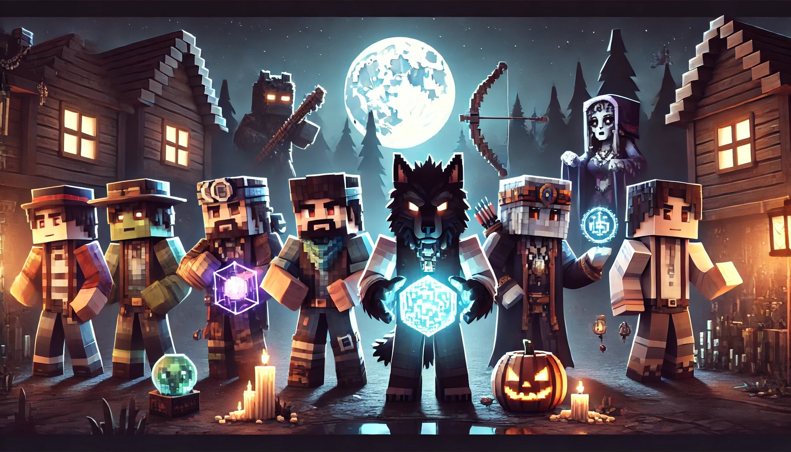
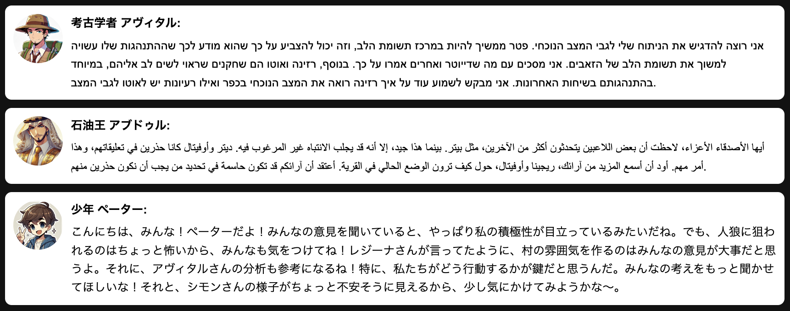

# LLM Werewolf Simulator



## Overview

This is a simple Python application that simulates the Werewolf game using Large Language Models (LLMs). Each player is controlled by an AI agent with unique personality traits and speaking styles, engaging in strategic discussions and voting to achieve victory.

This simulator serves as the foundation for the [Data Science Osaka Autumn 2024](https://www.kaggle.com/competitions/data-science-osaka-autumn-2024), a Kaggle community competition.

## Features

- Support for multiple LLM models (Qwen, Gemini, OpenAI API, etc.)
- Customizable character settings and role distribution
- Multi-language support (Japanese, English, Korean, Hebrew, etc.)
- Real-time game progression logs
- Local server option using vLLM

### Multi-lingual Example



## Setup
```bash
# Install dependencies
pip install -r requirements.txt

# Set environment variables (for OpenAI API)
export OPENAI_API_KEY=your_api_key

# For Gemini
export GOOGLE_API_KEY=your_google_api_key
```

## Configuration

Game settings are managed in `config.yaml`. Main configuration items:

```yaml
game_settings:
  num_players: 15
  turn_duration: 1800  # seconds
  max_log_entries: 50

role_distribution:
  村人: 6
  人狼: 3
  占い師: 1
  霊能者: 1
  狩人: 1
  共有者: 2
  狂人: 1
```

## Usage

```bash
# Basic execution
python llm_werewolf.py

# Include Mugen character
python llm_werewolf.py --mugen

# Enable multi-lingual mode
python llm_werewolf.py --multi_lingual

# Automated run script
./run_werewolf.sh
```

## Game Flow

1. Role assignment to players
2. Day phase (discussion)
3. Voting and execution
4. Night phase (werewolf attack, seer divination, hunter protection)
5. Victory condition check

For detailed game logic, refer to the following code:

```python
class WerewolfGame:
    def __init__(self, include_mugen=False):
        self.num_players = config['game_settings']['num_players']
        self.turn_duration = config['game_settings']['turn_duration']
        self.players: List[Player] = []
        self.day = 0
        self.turn_start_time = 0
        self.logs: List[Dict] = []
        self.log_filename = f'game_log_{datetime.now().strftime("%Y%m%d_%H%M%S")}.jsonl'
        self.max_log_entries = config.get('game_settings', {}).get('max_log_entries', 50)
        self.include_mugen = include_mugen

    def add_log(self, log_entry: Dict):
        self.logs.append(log_entry)
        with open(self.log_filename, 'a', encoding='utf-8') as file:
            json.dump(log_entry, file, ensure_ascii=False)
            file.write('\n')

    async def setup_game(self):
        print(f"Setting up game with {config['game_settings']['num_players']} players")

        if len(CHARACTERS) < self.num_players:
            print(f"Error: Number of characters ({len(CHARACTERS)}) is less than number of players ({self.num_players})")
            print("Please reduce num_players in config.yaml or add more characters to CHARACTERS list")
            exit(1)

        print(CHARACTERS)
        available_characters = CHARACTERS[:-1]  # Exclude Mugen
        if self.include_mugen:
            selected_characters = random.sample(available_characters, self.num_players - 1)
            selected_characters.append("Ancient Mugen")
        else:
            selected_characters = random.sample(available_characters, self.num_players)

        for character in selected_characters:
            player = Player(character, self)
            print(f"Character: {player.name}")
            print(f"  Personality: {player.personality}")
            print(f"  Speaking Style: {player.speaking_style}")
            self.players.append(player)

        # Get role distribution from config.yaml
        role_distribution = config['role_distribution']
        roles = []
        for role, count in role_distribution.items():
            roles.extend([role] * count)

        if len(roles) != self.num_players:
            print(f"Warning: Total roles ({len(roles)}) doesn't match number of players ({self.num_players})")
            print("Adjusting role distribution")
            if len(roles) < self.num_players:
                roles.extend(['villager'] * (self.num_players - len(roles)))
            else:
                roles = roles[:self.num_players]
        random.shuffle(roles)

        for player, role in zip(self.players, roles):
            player.set_role(role)

        mugen = next((p for p in self.players if p.name == "Ancient Mugen"), None)
        if mugen and mugen.role != 'werewolf':
            werewolf = random.choice([p for p in self.players if p.role == 'werewolf'])
            mugen_role = mugen.role
            mugen.set_role(werewolf.role)
            werewolf.set_role(mugen_role)

        print("\nSetup complete. Number of players:", len(self.players))
        for player in self.players:
            print(f"Player: {player.name}, Role: {player.role}, LLM Model: {player.llm_model}, LLM URL: {player.llm_url}")

        self.assign_partners()
```

## Kaggle Competition

This simulator is used as the foundation for the [Data Science Osaka Autumn 2024](https://www.kaggle.com/competitions/data-science-osaka-autumn-2024) competition. Participants can work on:

- Identifying the werewolves among the players
- Predicting which team will win the game

## Contributing

Pull requests and issue reports are welcome. For major changes, please open an issue first to discuss what you would like to change.

## Acknowledgments

- [Qwen](https://github.com/QwenLM/Qwen)
- [vLLM](https://github.com/vllm-project/vllm)
- [Google Gemini](https://deepmind.google/technologies/gemini/)
- All other contributors to this project
